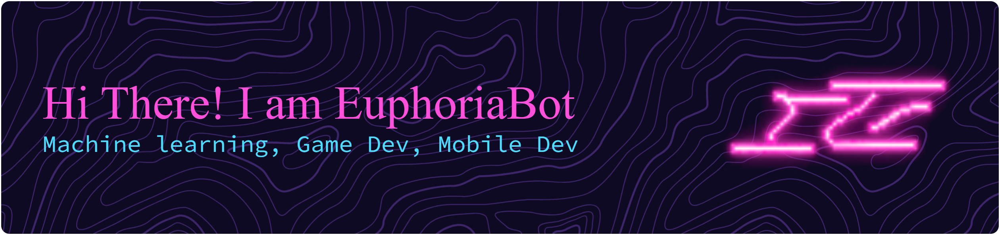

<h1 align="center">
  
</h1>

---

## 💻 Tech Stack

### Languages

  
  
  
  
  
  
  
  
  
  
  

### Frameworks & Library

  
  
  
  
  

### IDE

  
  
  
  
  
  

### Database

  
  

### Artificial Intelligence

  
  
  
  

### Social

  
  
  
  

---

## 📊 GitHub Stats

  
  
  

